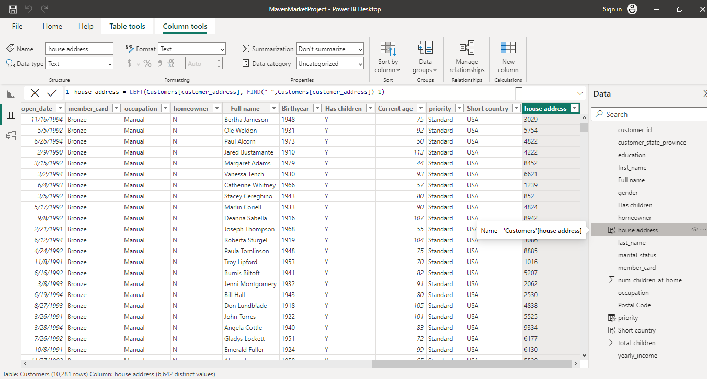

**MAVEN MARKET TRANSACTIONS ANALYSIS**
***

***
**Introduction**

    To carry out the task on the introductory section on the Project Instructions file i uploaded and recommend a data driven decision that is rational enough to improve productivity.
***
**Data sourcing**
***

       The datasets (year 1997-1998 transactions) was gotten from Maven market ;
- Maven Market is a kosher grocery store, bakery, butcher shop, caterer, deli, grocery delivery service, produce market, supermarket and sushi takeaway located physically in 1000 Reisterstown Pikesville, Maryland in USA and known as Digi Maven Solution in Lagos ,Nigeria as a Marketing agency.It is located physically at 175,Herbert Macaulay Way,Yaba ,Lagos.
- Maven Market is a great option for those looking for a convenient and reliable way to shop for kosher groceries. The store offers a wide variety of products including fresh produce, meats, dairy products, baked goods and more.
- If you are looking for a kosher grocery store in the Pikesville area, Maven Market is a great option. The store is well-stocked, convenient and offers a variety of services.
- It located in two countries has a Google rating of 4.6 out of 670 reviews. The store is open from 7am to 8pm on Sundays, 7am to 9pm on Mondays through Wednesdays, 7am to 9pm on Tuesdays, 7am to 10pm on Wednesdays, 7am to 11pm on Thursdays and 7am to 4:30pm on Fridays.
***
**Skills Demonstrated**
 ***
- Data transformation using power query editor to name columns accordingly.
- Data modeling
- Exploration of my DAX knowledge capabilities i.e using DAX function to create Calculated Columns and Measures while carrying out Exploaratory Data Analysis.

**Data Modeling**
***

***
Relationship were created as thus;
- Customers, Products and Stores using valid primary/foreign keys to Transaction_Data Table to form a 1 to many relationship.
- Calendar to Transaction_Data Table to form a one(1) to many relationship using both date fields with an inactive "stock_date" relationship
- Products, Calendar and Stores using valid primary/foreign keys to Return_Data Table  to form a 1 to many relationship. -- Region to Stores  Table to form as a "snowflake" schema.

**Analysis and Visualization**
***
**Measures created using DAX**
:---------------------------:

 

**Calculated Columns using DAX**
:---------------------------:

**VISUALIZATION**

***
 This section comprises the summary of the key metrics used as visuals for data visualization ;
- From the L.H.S ,the matrix visual was used to display the top 30 transactions with respect to product brand alongside the dimension fields that were calculated with Measures. 
- Multi-card visuals was used to display the top 3 sales by district so as to generate the top 3 total revenue.
- Area-chart displays an impressive turn out for the Quantity of goods sold in 1998 compared to 1997
- The top 3 dominant categories (Partially High school,High school and Bachelors degree holders) of consumers for the top 30 product mostly consumed shows a wide margin .
***
**Recommendation**

     - The targeted consumers are Partially High school,High school and Bachelors degree holders which implies that the exact brands and  related products that are mostly consumed should be made available in large quantities in district with impressive consumption .
    -  More advertisement and discount sales/promo should be done in the bottom 10 cities with low consumption. 

